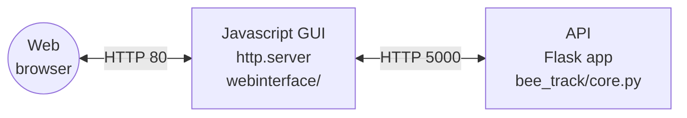

# bee_track
This explains how to setup a headless pi, how to setup aravis, this project and make it so the project runs on boot with no interaction

## Pi setup and connection
This section explains how to setup a blank sd card and Pi4 as a headless Pi you can SSH into

- Flash OS using Raspbian Imager. You can specify the name and password of your wifi hotspot before flashing, so that the Pi will be able to access the network.
- Unplug and replug into PC
- Go to boot partition (bootfs) (NOT root/boots), to create files, by

`cd /media/USERNAME/bootfs`

- Create a blank file `ssh.txt`, by

`touch ssh.txt`

- Create a file `wpa_supplicant.conf` by

`sudo nano wpa_supplicant.conf`

Write the following:
```
ctrl_interface=DIR=/var/run/wpa_supplicant GROUP=netdev
update_config=1
country=GB

network={
	ssid="WiFi SSID"
	psk="WPA/WPA2 passphrase"
	key_mgmt=WPA-PSK
}
```
- Insert SD card into Pi and power on, wait until Pi turns up as connected on hotspot 

- Find IP address of Pi :

`ping raspberrypi.local`

- SSH to Pi:

`ssh pi@IP`

## Project setup
- First create a virtual python environment where all python and pip commands must be run:

`python3 -m venv bee-venv`

- Activate the virtual environment:

`source bee-venv/bin/activate`

- Clone the 'bee_track' repo:

`git clone https://github.com/SheffieldMLtracking/bee_track.git`

- Run `aravissetup` from the root directory

`source bee_track/aravissetup`
, entering "y" when prompted

This should install any dependencies needed for aravis, clone aravis, setup, build and install it ready to be used.

- THEN install python dependencies in the venv (make sure it `(bee-venv)` is on the left of the bash)

`pip install -r bee_track/requirements.txt`

This must be done after running `aravissetup` because some of the python modules rely on some of the installs when installing aravis.

- Set the device ID file: make a new file called 'device_id.txt' in the `~/bee_track/webinterface` folder:

`sudo nano ~/bee_track/webinterface/device_id.txt`

In the new file write a single number identifying the box, on a single line line (e.g. `1015`).


### Running Beetrack on Boot automatically
To run the project on a headless pi with no interaction you must complete the following steps. Bear in mind it takes a good 3-5 minutes to get up and running every boot.

- Edit rc.local by

`sudo nano /etc/rc.local`

- Add the following line:

`su - pi -c /home/pi/bee_track/startup &`

Before exit 0

- Add the following to `/etc/network/interfaces`

```
auto lo
iface lo inet loopback

auto eth0
iface eth0 inet static
address 169.254.160.220
```

*It looks as though the latest version of the Raspberry Pi OS no longer uses  `etc/rc.local` and `etc/network/interfaces`. We can create and enable `rc.local` ourselves, but I haven't yet figured out how to re-enable `etc/network/interfaces`. Instead, I am using `rc.local` to establish the ethernet connection for the cameras on startup:*

- *Create `rc.local` file:*

`sudo nano /etc/rc.local`


- *Write in the following:*
```
#!/bin/sh
# add your commands
# call your scripts here
ifconfig eth0 up 169.254.160.220
su - pi -c /home/pi/bee_track/startup &
/home/pi/bee_track/startupssh
# last line must be exit 0
exit 0
```
*Note that this does three things: it replaces `etc/network/interfaces` to configure the ethernet connection; it starts beetrack on startup; and it starts autossh to establish a connection to the AWS server (see section below). If you do not need the autossh connection, delete the line `/home/pi/bee_track/startupssh`*

- *Set permissions:*

`sudo chmod -v +x /etc/rc.local`

- *Enable `rc.local`:*

`sudo systemctl enable rc-local.service`

- When you reboot (`sudo reboot`), the project should run without any interaction. You can reboot now, or continue with the following sections before rebooting.


### Setting up autossh

We use autossh to establish a connection to our AWS server. This is used to allow us to access the boxes remotely and for the automatic data backup pipeline. We also use ssh connections to remotely use the web interface to control boxes.

If you need to access or backup boxes remotely, follow these steps:

- Install autossh:

`sudo apt install autossh`

- If you did not already do so in the previous step, edit `rc.local` to add the following line before `exit 0`:
```
/home/pi/bee_track/startupssh
```

Edit startupssh by

`sudo nano /home/pi/bee_track/startupssh`

- The file should already contain the following lines:
```
sleep 30
autossh -f -R 5003:localhost:22 ohio@iot.bugtrack.org.uk -i/home/pi/.ssh/KEYFILE.pem -N -o StrictHostKeyChecking=no
```

If not, add them.

- Then add:
```
autossh -N -f -R 8003:localhost:8000 ohio@iot.bugtrack.org.uk -i/home/pi/.ssh/KEYFILE.pem -o StrictHostKeyChecking=no
autossh -N -f -R 6003:localhost:5000 ohio@iot.bugtrack.org.uk -i/home/pi/.ssh/KEYFILE.pem -o StrictHostKeyChecking=no
```

*Make sure you replace `5003`, `8003` and `6003` with port numbers that are unique to your box, so that we can establish connections to multiple boxes. I have been using the following pattern:*

*Each box is identified by a four digit number, e.g. `1035`. For port 22, add 4000, to get e.g. `5035`. For port 8000, add 7000, to get e.g. `8035`. For port 5000, add 5000, to get e.g. `6035`*

- Set permissions:

`sudo chmod 755 /home/pi/bee_track/startupssh`

- Ensure you are in the home directory (`cd`). Try to navigate to '.ssh' directory by

`cd .ssh`. If directory does not exist, create it by `mkdir .ssh`, then navigate to it by `cd .ssh`.

- Get key file for AWS server. *I'm not going to publicly post instructions for that, so contact Mike or Joe if you need access.*

- Set permissions:

`chmod 400 KEYFILE.pem`


### Adding further wifi networks

We typically set up our Pis to automatically join a wifi hotspot to give us local network access, by specifying this when flishing with Raspberry Pi imager. You may also want the boxes to automatically join other networks if they are available. For example, our Ohio boxes join the University network.

- The simplest way to do this is via the network manager, which you call by:

`sudo nmtui`

Follow the GUI menu  system to create a new wifi connection and specify the network name and password.


## If you want to make edits

You will probably want to reinstall with git an editable version

(bee-venv)$ `pip uninstall bee_track`

(bee-venv)$ `cd ~/bee_track`

(bee-venv)$ `pip install -e .`


# Running Beetrack from command line

- Make sure you are in virtual environment where all the installs have occured

`source bee-venv/bin/activate`

- Go to bee_track directory:

`cd bee_track`

- Start ethernet connection to camereas:

`sudo ifconfig eth0 up 169.254.160.220`

- Check cameras are working:

`arv-camera-test-0.10`

- Start bee_track:

`./startupfast`

- If something goes wrong use:

`killall python3`

- Connect to Pi with:

http://raspberrypi.local:8000/


# Manual Setup

## Python Setup

In root directory of the pi (or create project dir with all files in)
`git clone https://github.com/lionfish0/bee_track.git`

Setup virtual environment
`python -m venv bee-venv`

Activate - (if using SSH terminal to change python env)
Make sure all commands are run in the virtual environment from now on
`source bee-venv/bin/activate`

`pip install -e bee_track/.`
`sudo apt install libatlas3-base`


## Aravis setup

`git clone https://github.com/AravisProject/aravis.git`

`sudo apt install cmake`

and

`sudo apt install libgtk-3-dev libnotify-dev libgstreamer1.0-dev libgstreamer-plugins-base1.0-dev gstreamer1.0-plugins-bad`

and

`sudo apt-get install gnome-common intltool valac libglib2.0-dev gobject-introspection libgirepository1.0-dev libgtk-3-dev libgnome-desktop-3-dev libcanberra-dev libgdata-dev libdbus-glib-1-dev libgstreamer1.0-dev libupower-glib-dev libxml2-dev`

`meson setup aravis/`

`cd aravis`

`meson build`

`cd build`

`meson configure -Dviewer=enabled -Dintrospection=enabled -Dgst-plugin=enabled`

`sudo ninja install` might have to `pip install ninja`


## Beetrack setup

Important installs:

`pip install PyGObject rpimotorlib rpi-lgpio psutil spidev requests`

```
pip install scipy
git clone https://github.com/lionfish0/retrodetect.git
cd retrodetect
pip install -e .
git clone https://github.com/lionfish0/QueueBuffer.git
cd QueueBuffer
pip install -e .
pip install libsvm
pip install -U flask-cors
pip install mem_top
pip install flask_compress
```


# Architecture

This is a simplified overview of the different parts of this system and how they communicate.



## API architecture

The Flask application has four components which run in separate threads:

- Cameras
- Triggers
- Rotation
- Tracking

Each thread has a worker process with a configuration message queue.

# Usage

TODO

# Development

## Testing

TODO

## Virtual environment

These are instructions for running the API app on a virtual Raspberry Pi machine using [dockerpi](https://github.com/lukechilds/dockerpi).

1. Install Docker
2. Download the latest stable [Raspberry Pi OS Lite image](https://www.raspberrypi.com/software/operating-systems/)
3. Decompress the image `unxz *.xz`
4. Run a virtual machine (`p3` means Rasp. Pi version 3, which is under experimental support)

```bash
image_path="./2023-12-11-raspios-bookworm-arm64-lite.img"
docker run -it -v $image_path:/sdcard/filesystem.img lukechilds/dockerpi:vm p3
```

TODO this doesn't work
