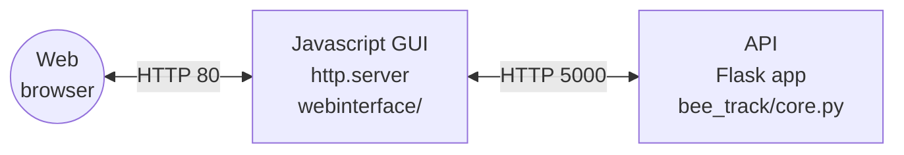

# bee_track
This explains how to setup a headless pi, how to setup aravis, this project and make it so the project runs on boot with no interaction

## Pi setup and connection
This section explains how to setup a blank sd card and Pi5 as a headless Pi you can SSH into

- Flash OS using Raspbian Imager
- Unplug and replug into PC
- Create files in boot partition (bootf) (NOT root/boot):
-- `touch ssh.txt`

-- Create a file `wpa_supplicant.conf` with the following:
```
ctrl_interface=DIR=/var/run/wpa_supplicant GROUP=netdev
update_config=1
country=GB

network={
	ssid="WiFi SSID"
	psk="WPA/WPA2 passphrase"
	key_mgmt=WPA-PSK
}
```
Insert into PI and power on, wait until pi turns up as connected on hotspot 

- Find ip address of Pi : `ping raspberrypi.local`
- SSH to pi: `ssh pi@IP`

## Project setup
First create a virtual python environment where all python and pip commands must be run

`python3 -m venv bee-venv`

Then activate the virtual environment with

`source bee-venv/bin/activate`

Next we clone this repo

`git clone https://github.com/SheffieldMLtracking/bee_track.git`

First run `aravissetup` from the root directory

`source bee_track/aravissetup`
, entering "y" when prompted

This should install any dependencies needed for aravis, clone aravis, setup, build and install it ready to be used.

THEN install python dependencies in the venv (make sure it `(bee-venv)` is on the left of the bash)

`pip install -r bee_track/requirements.txt`

This must be done after running aravissetup because some of the python modules rely on some of the installs when installing aravis.

# Running Beetrack from command line

Make sure you are in virtual environment where all the installs have occured

`source bee-venv/bin/activate`

`cd bee_track`

`sudo ifconfig eth0 up 169.254.160.220`

Check cameras are working:
`arv-camera-test-0.10`

`./startupfast`

If something goes wrong use
`killall python3`

Connect to pi with:

http://raspberrypi.local:8000/

## If you want to make edits

You will probably want to reinstall with git an editable version
`(bee-venv)$ pip uninstall bee_track
(bee-venv)$ cd ~/bee_track
(bee-venv)$ pip install -e .`

# Running Beetrack on Boot automatically
To run the project on a headless pi with no interaction you must complete the following steps. Bear in mind it takes a good 3-5 miniutes to get up and running every boot.

Edit rc.local by
`sudo nano /etc/rc.local`
Add the following line:

`su - pi -c /home/pi/bee_track/startup &`

Before exit 0

Add the following to `/etc/network/interfaces`

```
auto lo
iface lo inet loopback

auto eth0
iface eth0 inet static
address 169.254.160.220
```

Reboot and the project should run without any interaction

# Manual Setup

## Python Setup

In root directory of the pi (or create project dir with all files in)
`git clone https://github.com/lionfish0/bee_track.git`

Setup virtual environment
`python -m venv bee-venv`

Activate - (if using SSH terminal to change python env)
Make sure all commands are run in the virtual environment from now on
`source bee-venv/bin/activate`

`pip install -e bee_track/.`
`sudo apt install libatlas3-base`


## Aravis setup

`git clone https://github.com/AravisProject/aravis.git`

`sudo apt install cmake`

and

`sudo apt install libgtk-3-dev libnotify-dev libgstreamer1.0-dev libgstreamer-plugins-base1.0-dev gstreamer1.0-plugins-bad`

and

`sudo apt-get install gnome-common intltool valac libglib2.0-dev gobject-introspection libgirepository1.0-dev libgtk-3-dev libgnome-desktop-3-dev libcanberra-dev libgdata-dev libdbus-glib-1-dev libgstreamer1.0-dev libupower-glib-dev libxml2-dev`

`meson setup aravis/`

`cd aravis`

`meson build`

`cd build`

`meson configure -Dviewer=enabled -Dintrospection=enabled -Dgst-plugin=enabled`

`sudo ninja install` might have to `pip install ninja`


## Beetrack setup

Important installs:

`pip install PyGObject rpimotorlib rpi-lgpio psutil spidev requests`

```
pip install scipy
git clone https://github.com/lionfish0/retrodetect.git
cd retrodetect
pip install -e .
git clone https://github.com/lionfish0/QueueBuffer.git
cd QueueBuffer
pip install -e .
pip install libsvm
pip install -U flask-cors
pip install mem_top
pip install flask_compress
```


# Architecture

This is a simplified overview of the different parts of this system and how they communicate.



## API architecture

The Flask application has four components which run in separate threads:

- Cameras
- Triggers
- Rotation
- Tracking

Each thread has a worker process with a configuration message queue.

# Usage

TODO

# Development

## Testing

TODO

## Virtual environment

These are instructions for running the API app on a virtual Raspberry Pi machine using [dockerpi](https://github.com/lukechilds/dockerpi).

1. Install Docker
2. Download the latest stable [Raspberry Pi OS Lite image](https://www.raspberrypi.com/software/operating-systems/)
3. Decompress the image `unxz *.xz`
4. Run a virtual machine (`p3` means Rasp. Pi version 3, which is under experimental support)

```bash
image_path="./2023-12-11-raspios-bookworm-arm64-lite.img"
docker run -it -v $image_path:/sdcard/filesystem.img lukechilds/dockerpi:vm p3
```

TODO this doesn't work
