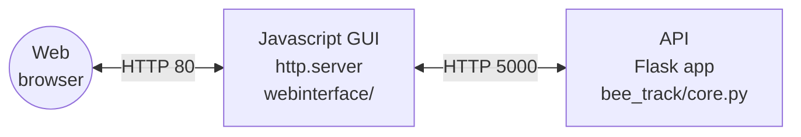

# Bumblebee Tracking System
This is a web-based bee tracking system that runs on a Raspberry Pi that may be accessed via a mobile phone. It controls a collection of cameras and captures data.

This code repository contains two systems:

- a front-end user interface implemented in HTML and Javascript;
- a back-end API implemented using the Flask web framework.

# Installation

## Getting the RPi set up

To make it possible to ssh into, use:

"For headless setup, SSH can be enabled by placing a file named ssh, without any extension, onto the boot partition of the SD card from another computer." -- https://www.raspberrypi.org/documentation/remote-access/ssh/


Edit `/etc/wpa_supplicant/wpa_supplicant.conf`, enter:

    ctrl_interface=DIR=/var/run/wpa_supplicant GROUP=netdev
    update_config=1
    
    network={
        ssid="SSID"
        psk="PASSWORD"
    }
    
    network={
        ssid="SSID"
        psk="PASSWORD"
    }

# Dependencies

Download the aravis library:

    git clone https://github.com/AravisProject/aravis.git

Or donwload earlier version from
http://ftp.gnome.org/pub/GNOME/sources/aravis/0.6/

then if you need the viewer (although I did find I had to split these installs).

    sudo apt install libgtk-3-dev libnotify-dev libgstreamer1.0 libgstreamer-plugins-base1.0-dev gstreamer1.0-plugins-bad

other stuff...

    sudo apt-get install gnome-common intltool valac libglib2.0-dev gobject-introspection libgirepository1.0-dev libgtk-3-dev libgnome-desktop-3-dev libcanberra-dev libgdata-dev libdbus-glib-1-dev libgstreamer1.0-dev libupower-glib-dev libxml2-dev

for a while now aravis has used meson for building...

    sudo pip3 install ninja meson
    
    cd aravis
    meson build
    cd build
    meson configure -Dviewer=enabled -Dintrospection=enabled -Dgst-plugin=enabled
    ninja
    sudo ninja install
    cd .. #to aravis
    sudo ldconfig

(maybe see https://github.com/sightmachine/SimpleCV/wiki/Aravis-(Basler)-GigE-Camera-Install-Guide)

Download this tool

```bash
pip install git+https://github.com/lionfish0/bee_track.git
```

In `/etc/rc.local` add line:

```bash
su - pi -c /home/pi/bee_track/startup &
```

Also to make numpy work:

```bash
sudo apt install libatlas3-base
sudo pip3 install numpy
```

Also:

```bash
pip3 install scipy
git clone https://github.com/lionfish0/retrodetect.git
cd retrodetect
pip3 install -e .
git clone https://github.com/lionfish0/QueueBuffer.git
cd QueueBuffer
pip3 install -e .
pip3 install libsvm
pip3 install -U flask-cors
pip3 install mem_top
pip3 install flask_compress
```

# Architecture

This is a simplified overview of the different parts of this system and how they communicate.



## API architecture

The Flask application has four main components, which are workers that run in separate threads:

- Cameras: reads in image data from a camera.
- Trigger: handles triggering the GPIO pins, etc.
- Rotation: sends a rotation signal to a stepper motor via GPIO pins.
- Tracking: takes images from the greyscale camera's image queue (cam.photo_queue) and looks for the tag

Each thread has a worker process with a configuration message queue.

## User interface

The front-end is implemented using jQuery, a popular JavaScript library for manipulating web pages. In simple terms, each HTML form widget in [webinterface/index.html](./webinterface/index.html) has an associated behaviour determined by the JavaScript code in [webinterface/track.js](./webinterface/track.js), which listens for certain events such as button clicks and makes a call to the back-end API using AJAX (Asynchronous JavaScript and XML).

| Button         | Button ID | Endpoint | Behaviour                   |
| -------------- | --------- | -------- | --------------------------- |
| Capture: Start | `#start`  | `/start` | Starts camera data capture. |
|                |           |          |                             |
|                |           |          |                             |

There is a JavaScript function called `msg()` that prints message to the "console" which is a HTML text area.

# Usage

The user interface is designed to control the bee tracker system.

1. Access the user interface
2. Enter a label for your files
3. Under capture, click "Start"
4. Under capture, click "Stop"

## API usage

The API returns HTTP responses.

```bash
$ curl http://192.168.50.58:5000/getimagecount
42
```

# Development

## Testing

TODO

## Virtual environment

These are instructions for running the API app on a virtual Raspberry Pi machine using [dockerpi](https://github.com/lukechilds/dockerpi).

1. Install Docker
2. Download the latest stable [Raspberry Pi OS Lite image](https://www.raspberrypi.com/software/operating-systems/)
3. Decompress the image `unxz *.xz`
4. Run a virtual machine (`p3` means Rasp. Pi version 3, which is under experimental support)

```bash
image_path="./2023-12-11-raspios-bookworm-arm64-lite.img"
docker run -it -v $image_path:/sdcard/filesystem.img lukechilds/dockerpi:vm p3
```

TODO this doesn't work
