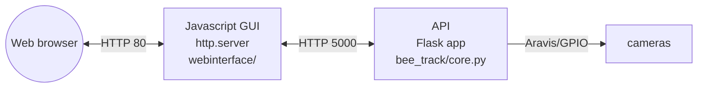
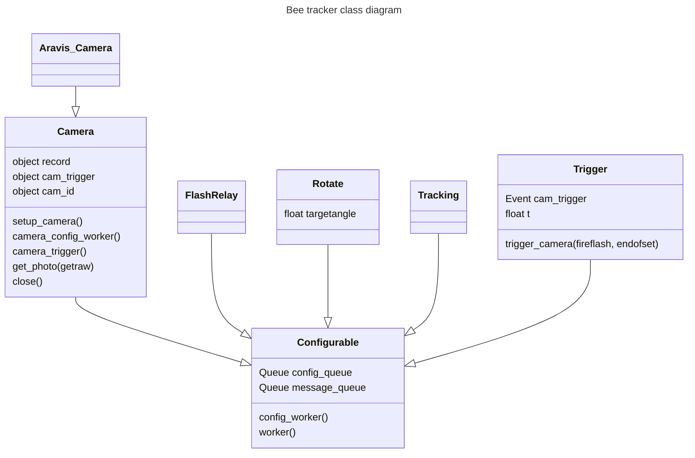

# bee_track
Tracking software to run on pi

# Getting the pi set up

To make it possible to ssh into, use:

"For headless setup, SSH can be enabled by placing a file named ssh, without any extension, onto the boot partition of the SD card from another computer." -- https://www.raspberrypi.org/documentation/remote-access/ssh/


Edit `/etc/wpa_supplicant/wpa_supplicant.conf`, enter:

    ctrl_interface=DIR=/var/run/wpa_supplicant GROUP=netdev
    update_config=1
    
    network={
        ssid="SSID"
        psk="PASSWORD"
    }
    
    network={
        ssid="SSID"
        psk="PASSWORD"
    }

# Installation

Download the Aravis library:

    git clone https://github.com/AravisProject/aravis.git

Or download earlier version from
http://ftp.gnome.org/pub/GNOME/sources/aravis/0.6/

then if you need the viewer (although I did find I had to split these installs).

    sudo apt install libgtk-3-dev libnotify-dev libgstreamer1.0 libgstreamer-plugins-base1.0-dev gstreamer1.0-plugins-bad

other stuff...

    sudo apt-get install gnome-common intltool valac libglib2.0-dev gobject-introspection libgirepository1.0-dev libgtk-3-dev libgnome-desktop-3-dev libcanberra-dev libgdata-dev libdbus-glib-1-dev libgstreamer1.0-dev libupower-glib-dev libxml2-dev

for a while now aravis has used meson for building...

    sudo pip3 install ninja meson
    
    cd aravis
    meson build
    cd build
    meson configure -Dviewer=enabled -Dintrospection=enabled -Dgst-plugin=enabled
    ninja
    sudo ninja install
    cd .. #to aravis
    sudo ldconfig

(maybe see https://github.com/sightmachine/SimpleCV/wiki/Aravis-(Basler)-GigE-Camera-Install-Guide)

Download this tool

    pip install git+https://github.com/lionfish0/bee_track.git

In /etc/rc.local add line:

    su - pi -c /home/pi/bee_track/startup &

Also to make numpy work:

    sudo apt install libatlas3-base
    sudo pip3 install numpy

Also:

    pip3 install scipy
    git clone https://github.com/lionfish0/retrodetect.git
    cd retrodetect
    pip3 install -e .
    git clone https://github.com/lionfish0/QueueBuffer.git
    cd QueueBuffer
    pip3 install -e .
    pip3 install libsvm
    pip3 install -U flask-cors
    pip3 install mem_top
    pip3 install flask_compress

# Architecture

This is a simplified overview of the different parts of this system and how they communicate.



## Frontend app

For more information about the user interface, see [webinterface/README.md](./webinterface/README.md).

## Backend app

The `main`() function runs `startup()` which initialises the system and runs the Flask application. This sets up multiple parallel processes that control different parts of the system which are stored in the global scope of the application.

`message_queue` is a first-in-first-out `multiprocessing.Queue` that's used for passing messages from the file manager and triggers.

### Workers

What is `Configurable`? `Configurable.worker()` is the function that runs in a separate process. Each worker (`Configurable`) has a `config_worker()` method that runs in a separate thread and listened for updated options which are used to change the attributes of that instance.

Parallel processes:

* Trigger
* Each camera
* Tracking
* Rotate

### Cameras

`Cameras` implement ?

What is tracking?

What is rotate?




# Virtual environment

These are instructions for running the API app on a virtual Raspberry Pi machine using [dockerpi](https://github.com/lukechilds/dockerpi). This is necessary to load the libraries that only work on Pi such as `RPi.GPIO`.

1. Install [Docker Engine](https://docs.docker.com/engine/).
2. Download the latest stable [Raspberry Pi OS Lite image](https://www.raspberrypi.com/software/operating-systems/)
3. Decompress the image `unxz *.xz`
4. Specify [the options](https://github.com/lukechilds/dockerpi?tab=readme-ov-file#which-machines-are-supported) for the emulator
5. Run a virtual machine (`pi3` means Rasp. Pi version 3, which is under experimental support) using the [docker run](https://docs.docker.com/reference/cli/docker/container/run/) command.

```bash
image_path="./2023-12-11-raspios-bookworm-arm64-lite.img"
pi_version="pi3"
docker run -it -v $image_path:/sdcard/filesystem.img lukechilds/dockerpi:vm $pi_version
```

We're using the `dockerpi:vm` container, which doesn't include the Pi OS image, because we want to use the latest one that we downloaded ourselves. We have to run the container in interactive mode (the `-it` option) because it's an ARM [emulator using QEMU](https://www.qemu.org/docs/master/system/target-arm.html), not a proper container base image.

An example command might be:

```bash
docker run -it -v .\2023-10-10-raspios-bookworm-armhf-lite.img:/sdcard/filesystem.img lukechilds/dockerpi:vm pi3
```

